# IMPLEMENTING LOAD BALANCERS WITH NGINX

## Requirements
- Have a Cloud Service Provider such as AWS
- Have a terminal on your computer

Step 1 - Provisioning EC2 instance

Go to your AWS Management Console and launch two instances choosing Ubuntu as the AMI of the instances. 

Step 2 - Next is to open port 8000 on both instances so that the webservers will be running on port 8000. To do this, follow the below steps: 
- Click on the instance ID;
- Click on the security;
- Click on action and select edit inbound rule;
- Open port 8000 and alloww all traffic;
- Click on save rules

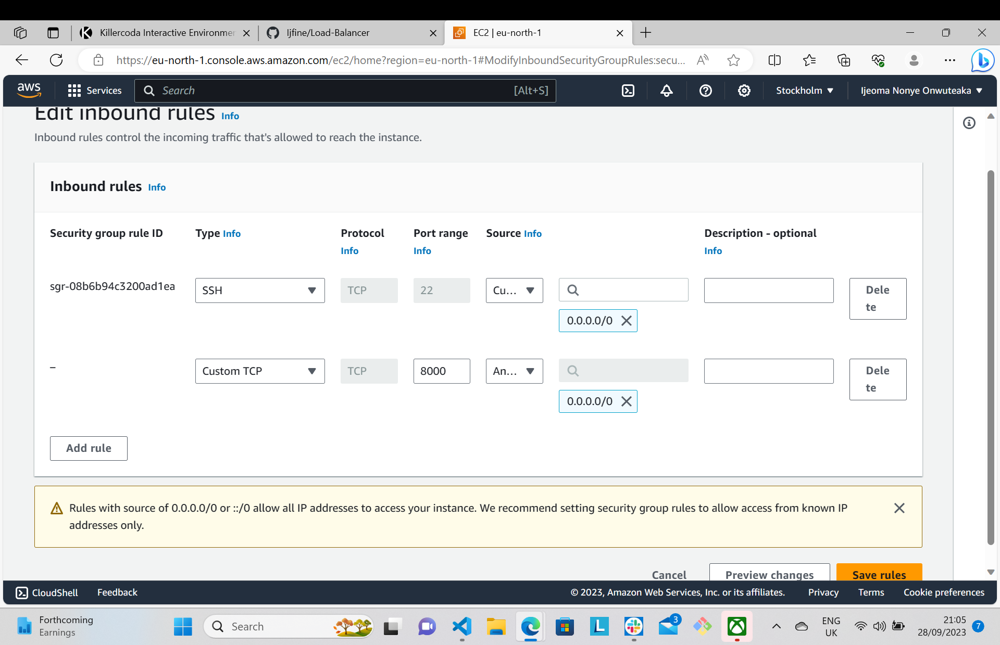

Step 3 - Install Apache webserver

Install apache software on both servers. To do so, connect each of the webserver through ssh to your terminal.

Then install apache with the below command:

```python
'sudo apt update -y &&  sudo apt install apache2 -y'
```
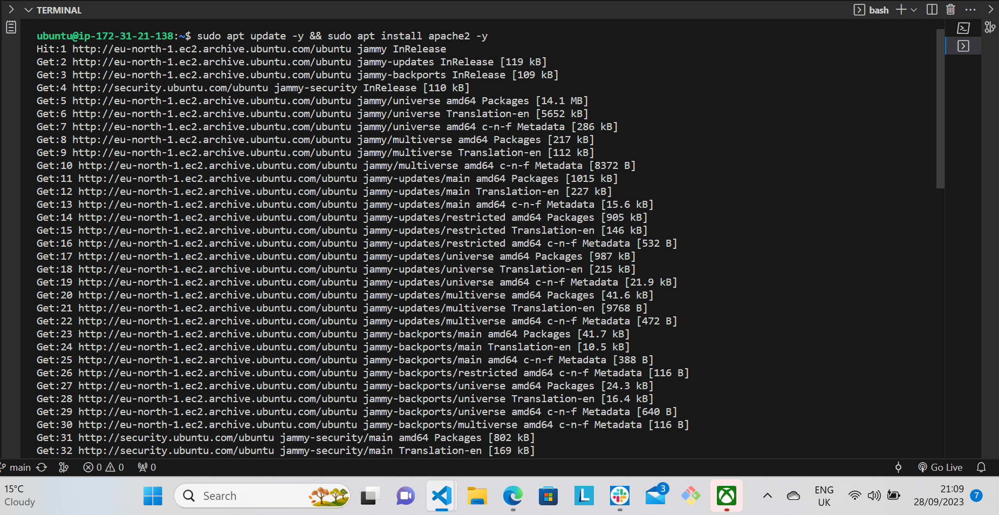

To confirm that apache is running, use the below command:

```python
'sudo systemctl status apache2'
```
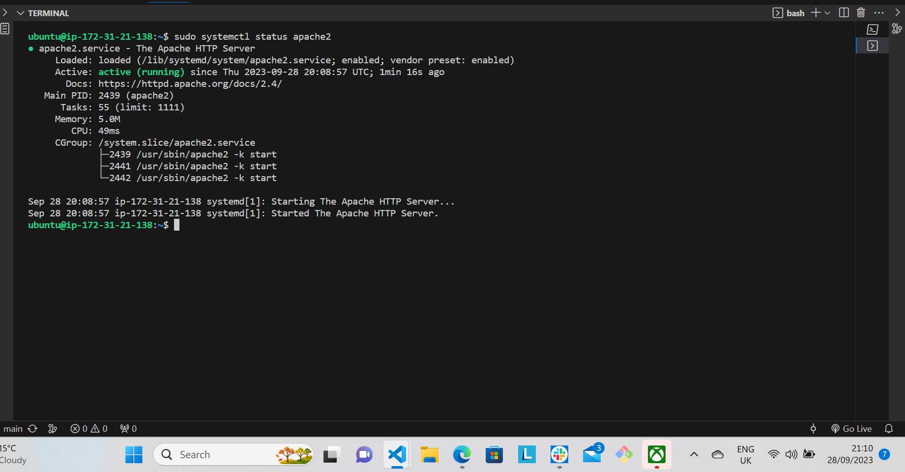

Step 4 - Configure Apache to serve a page showing its public IP. 

- Apache by default listens on port 80 but you will configure it to listen on port 8000. Follow the below steps:

Using any text editor, open the file /etc/apache2/ports.conf

```python
'sudo vi /etc/apache2/ports.conf'
``` 
Add a new listen directive for port 8000 and then save your file.

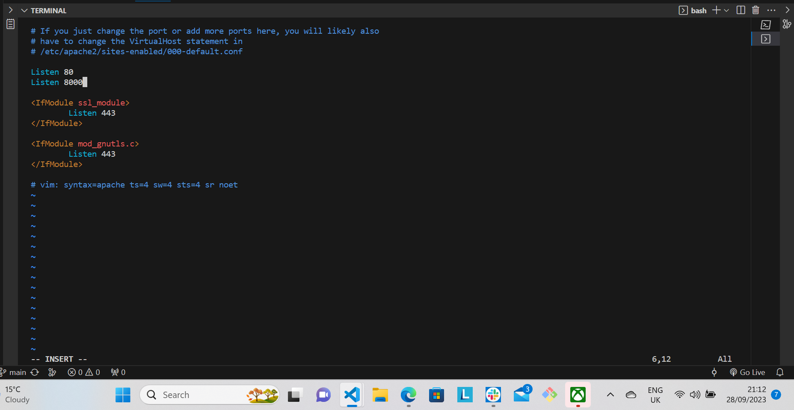

Next open the file /etc/apache2/sites-available/000-default.conf and change port 80 on the virtual host to 8000 and save it. Use the below command:

```python
'sudo vi /etc/apache2/sites-available/000-default.conf'
```

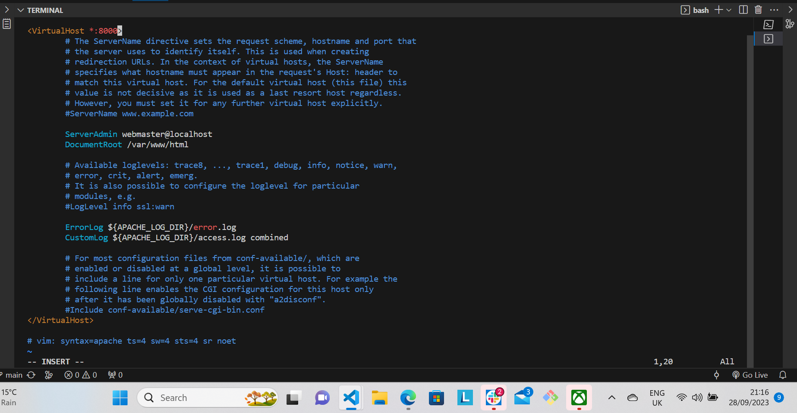

Then restart apache so as to load the new configuartion using the below command:

```python
'sudo systemctl restart apache2'
```

- Create a new html file

Open a new ***index.html*** file using the below command:

```python
'sudo vi index.html'
```
Inside the file paste the below html file, ensure you get the public IP of your EC2 instance and replace **YOUR_PUBLIC_IP** with it.

```python
        <!DOCTYPE html>
        <html>
        <head>
            <title>My EC2 Instance</title>
        </head>
        <body>
            <h1>Welcome to my EC2 instance</h1>
            <p>Public IP: YOUR_PUBLIC_IP</p>
        </body>
        </html>
```
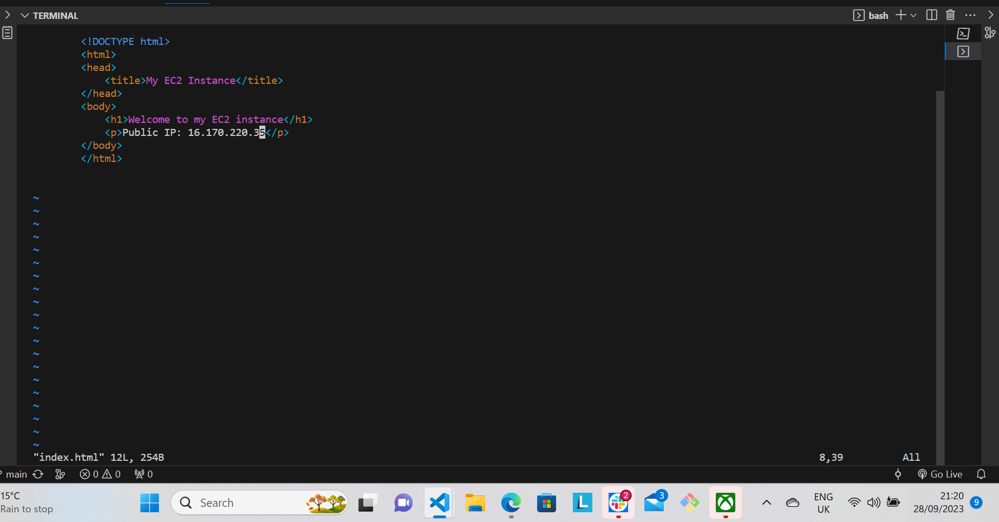

Change file ownership of the index.html file using the command below:

```python
'sudo chown www-data:www-data ./index.html'
```
- Override the default html file of the Apache webserver:

Replace the default html file with the new html file using the below command:

```python
'sudo cp -f ./index.html /var/www/html/index.html'
```
Restart the server so as to load the new configuration using the command below:

```python
'sudo systemctl restart apache2'

```
A page like the below image shoud come up.

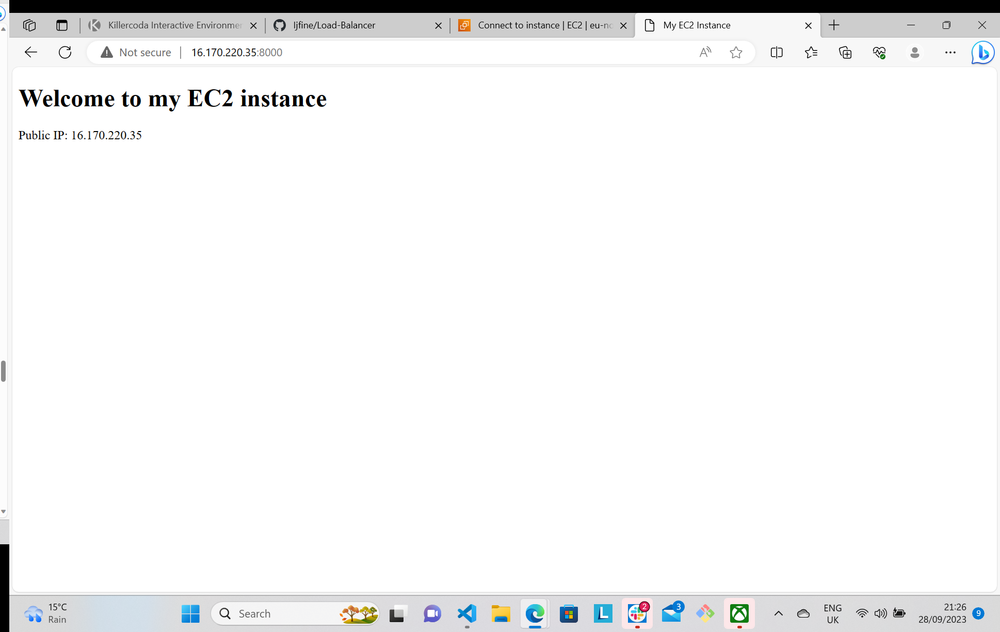

Step 5 - Configuring Nginx as a laod balancer

- Launch a new instance running on Ubuntu 22.04 and open port 80 accepting traffic from anywhere.

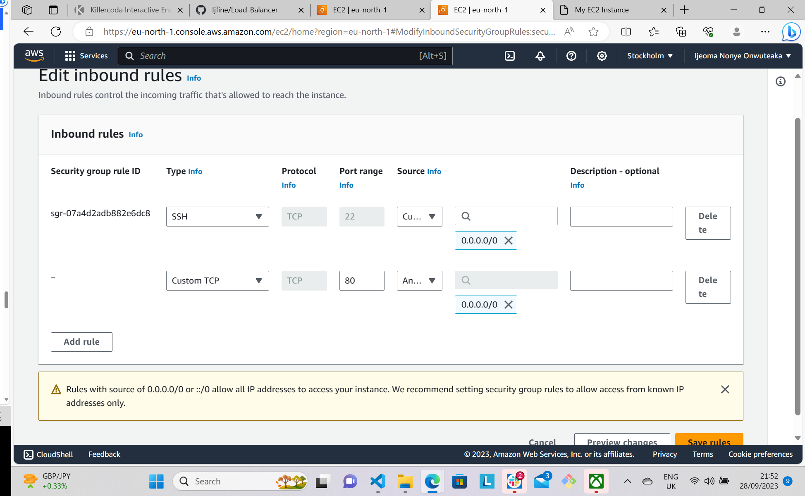

- Connect your instance to your terminal via ssh.
- Install Nginx using the below command:
```python
'sudo apt update -y && sudo apt install nginx -y'
```
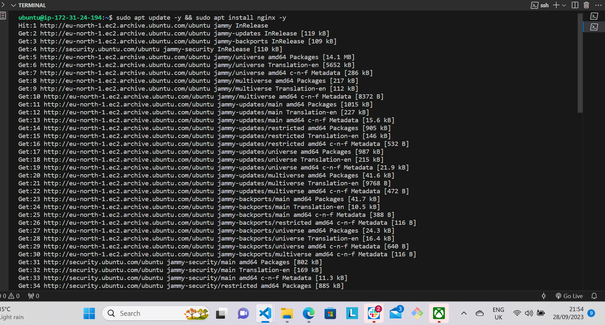

- Confirm that Nginx is running with the below command:
```python
'sudo systemctl status nginx'
```
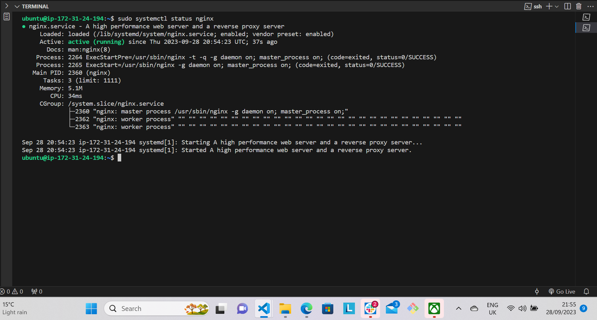

- Open Nginx configuration file with the below command:
```python
'sudo vi /etc/nginx/conf.d/loadbalancer.conf'
```
- Paste the below configuration file to configure nginx to act as a load balancer. Ensure you use your server IP address in the appropriate places.

```python
        
        upstream backend_servers {

            # your are to replace the public IP and Port to that of your webservers
            server 127.0.0.1:8000; # public IP and port for webserser 1
            server 127.0.0.1:8000; # public IP and port for webserver 2

        }

        server {
            listen 80;
            server_name <your load balancer's public IP addres>; # provide your load balancers public IP address

            location / {
                proxy_pass http://backend_servers;
                proxy_set_header Host $host;
                proxy_set_header X-Real-IP $remote_addr;
                proxy_set_header X-Forwarded-For $proxy_add_x_forwarded_for;
            }
        }
    
```
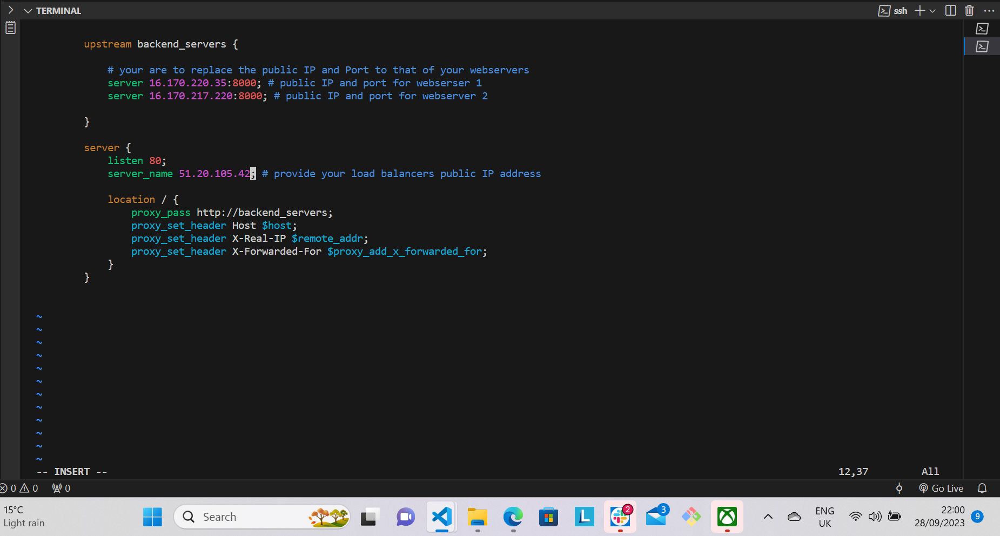

- Test your configuration with the below command:
```python
'sudo nginx -t'
```
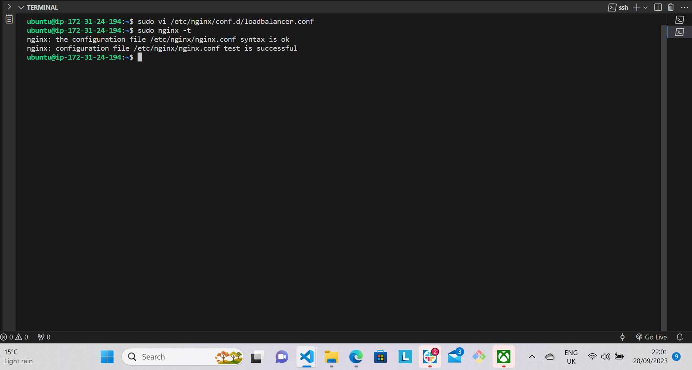

- Restart Nginx to load the new configuration with the below command:

```python
'sudo systemctl restart nginx'
```
- Paste the public IP address of the Nginx load balancer on your browser, you should see the same webpages served by the webservers.

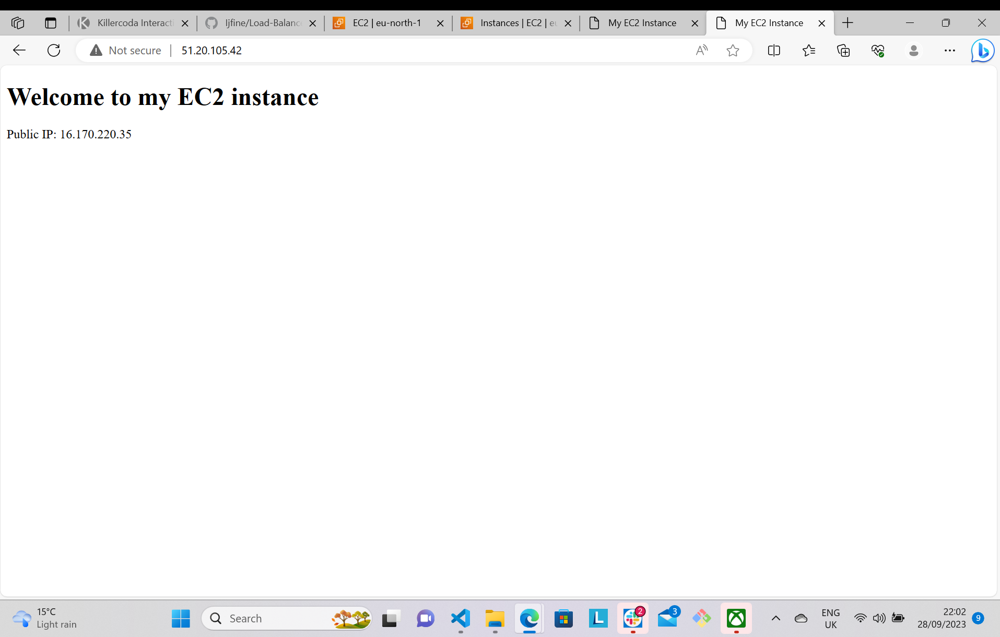

